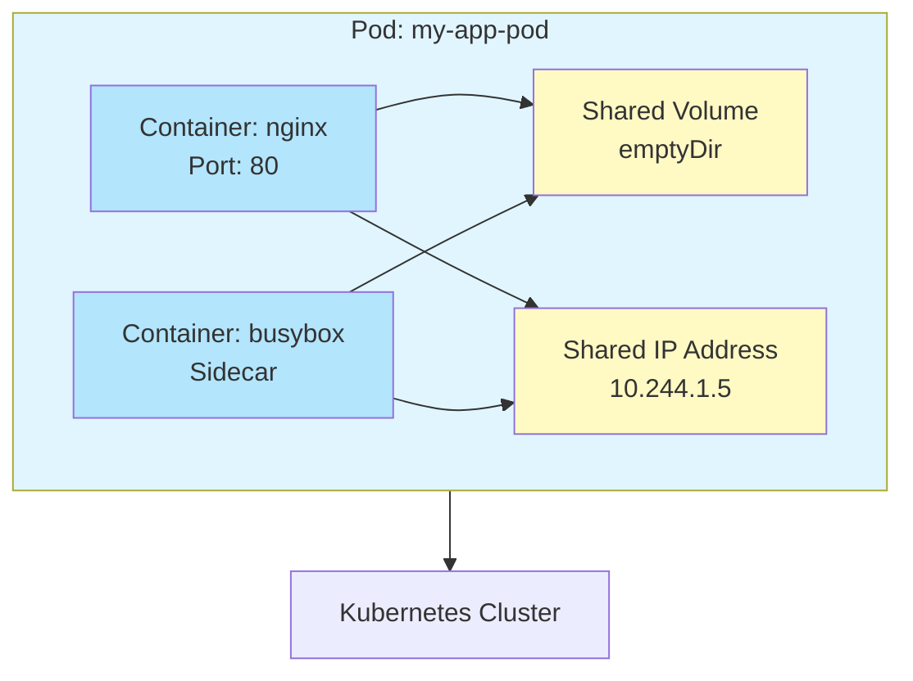
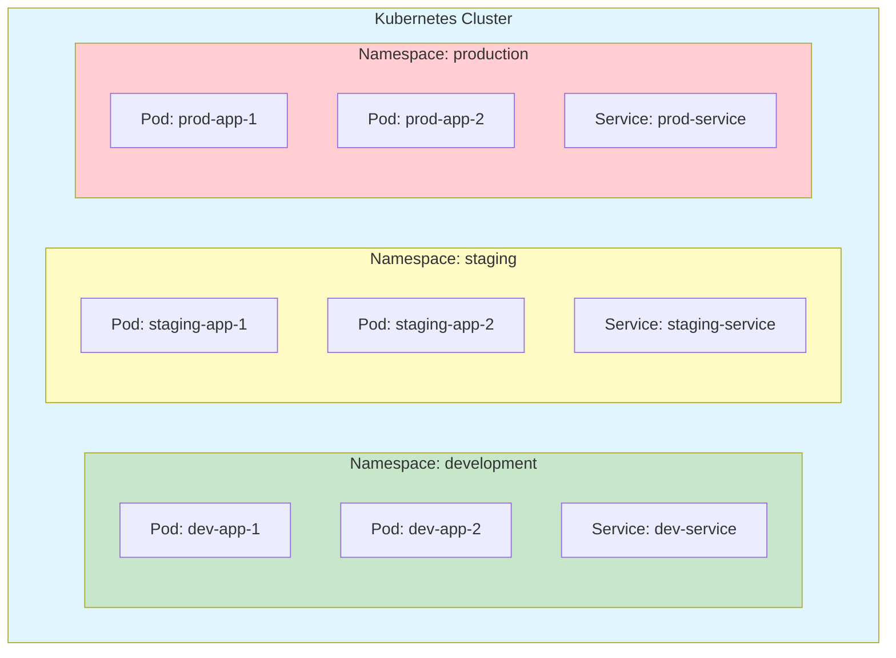
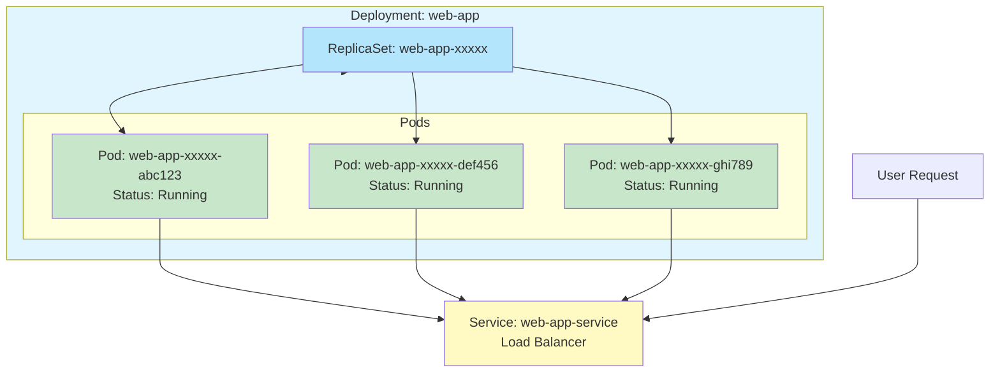
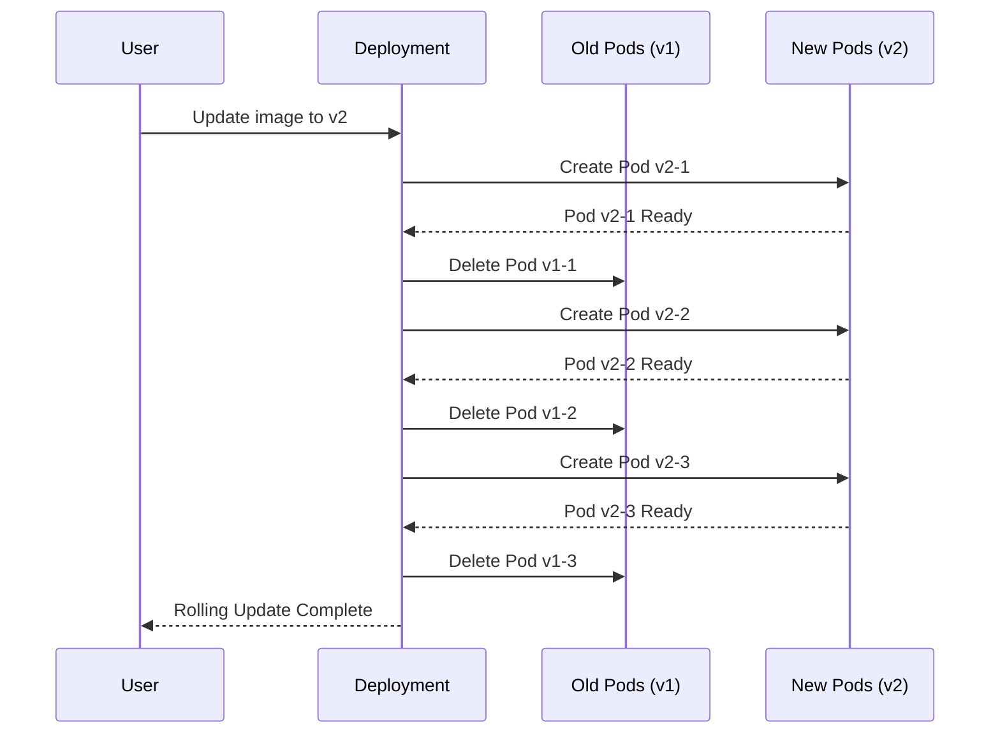
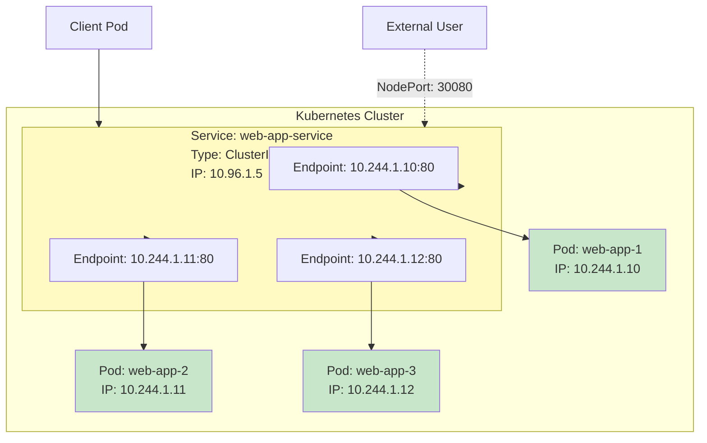
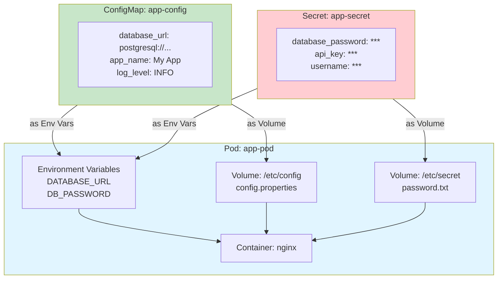
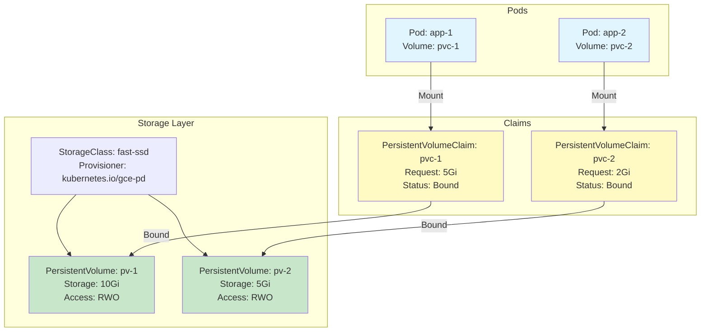
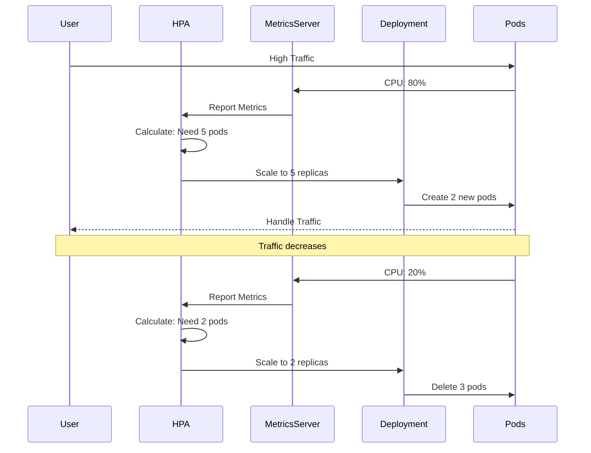
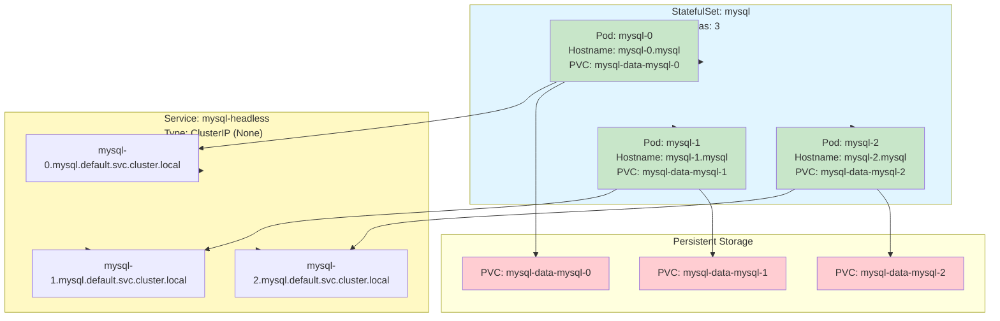

# Panduan Lengkap Belajar Kubernetes dari Dasar

#Kubernetes #DevOps #Container #CloudNative #Learning

# Table of contents
- [[#Pendahuluan]]
- [[#1-pod]]
- [[#2-namespace]]
- [[#3-deployment]]
- [[#4-service]]
- [[#5-configmap--secret]]
- [[#6-volume--persistentvolume]]
- [[#7-horizontalpodautoscaler-hpa]]
- [[#8-statefulset]]
- [[#materi-tambahan]]
- [[#studi-kasus-lengkap]]
- [[#command-cheat-sheet]]
- [[#troubleshooting]]
- [[#kesimpulan]]
- [[#referensi]]

## Pendahuluan

### Apa itu Kubernetes?
Kubernetes (sering disingkat **K8s**) adalah platform open-source untuk mengelola *containerized applications* secara otomatis. Kubernetes membantu Anda:
- **Deploy** aplikasi dengan mudah  
- **Scale** aplikasi sesuai kebutuhan  
- **Manage** aplikasi secara otomatis  
- **Update** aplikasi tanpa downtime  

### Konsep Dasar
Kubernetes bekerja dengan konsep **declarative configuration** — Anda mendeskripsikan keadaan yang diinginkan, dan Kubernetes akan memastikan keadaan tersebut tercapai.

### Prasyarat
Sebelum memulai, pastikan Anda sudah menginstal:
- **`kubectl`** – Command line tool untuk Kubernetes  
- **`minikube`** – Tool untuk menjalankan Kubernetes secara lokal  

### Verifikasi Instalasi
```bash
# Cek kubectl
kubectl version --client

# Cek minikube
minikube version

# Start minikube
minikube start

# Verifikasi cluster
kubectl cluster-info
kubectl get nodes
```

---

## 1. Pod

### Penjelasan
**Pod** adalah unit terkecil dan paling dasar di Kubernetes. Pod adalah wrapper untuk satu atau lebih container yang berjalan bersama-sama.

> **Analogi**: Bayangkan Pod seperti sebuah **apartemen** yang bisa dihuni oleh satu atau lebih orang (container). Semua orang di apartemen yang sama berbagi alamat (IP address) dan fasilitas (storage, network).

### Kegunaan Pod
1. **Unit Deployment** – Pod adalah unit terkecil yang bisa di-deploy.
2. **Container Wrapper** – Membungkus satu atau lebih container.
3. **Shared Resources** – Container dalam Pod yang sama berbagi:
   - Network namespace (IP address yang sama)
   - Storage volumes
   - Memory dan CPU resources

### Diagram Struktur Pod


### Contoh Praktis

#### Pod Sederhana (Single Container)
Buat file `pod-simple.yaml`:
```yaml
apiVersion: v1
kind: Pod
metadata:
  name: my-first-pod
  labels:
    app: hello-world
    version: v1
spec:
  containers:
  - name: nginx-container
    image: nginx:alpine
    ports:
    - containerPort: 80
```

#### Pod Multi-Container
Buat file `pod-multi-container.yaml`:
```yaml
apiVersion: v1
kind: Pod
metadata:
  name: multi-container-pod
spec:
  containers:
  - name: nginx
    image: nginx:alpine
    ports:
    - containerPort: 80
    volumeMounts:
    - name: shared-data
      mountPath: /usr/share/nginx/html
  - name: busybox
    image: busybox:latest
    command: ['sh', '-c', 'echo "Hello from busybox" > /shared/index.html && sleep 3600']
    volumeMounts:
    - name: shared-data
      mountPath: /shared
  volumes:
  - name: shared-data
    emptyDir: {}
```

### Command Praktis
```bash
# Buat pod dari file YAML
kubectl apply -f pod-simple.yaml

# Cek status pod
kubectl get pods

# Detail pod
kubectl describe pod my-first-pod

# Lihat log pod
kubectl logs my-first-pod

# Lihat log container spesifik
kubectl logs multi-container-pod -c nginx
kubectl logs multi-container-pod -c busybox

# Akses pod (port-forward)
kubectl port-forward my-first-pod 8080:80

# Execute command di dalam pod
kubectl exec -it my-first-pod -- sh

# Hapus pod
kubectl delete pod my-first-pod
kubectl delete -f pod-simple.yaml
```

### Kapan Menggunakan Pod?
- **Testing** – Untuk testing container secara langsung  
- **One-off tasks** – Untuk tugas yang hanya perlu dijalankan sekali  
- **Development** – Untuk development lokal  
- **Debugging** – Untuk debugging masalah aplikasi  

> ⚠️ **Catatan**: Untuk production, biasanya kita menggunakan **Deployment** yang akan mengelola Pod secara otomatis.

---

## 2. Namespace

### Penjelasan
**Namespace** adalah cara untuk mengisolasi dan mengorganisir resource di Kubernetes. Namespace seperti "folder" atau "workspace".

> **Analogi**: Namespace seperti **gedung apartemen** dengan beberapa **lantai**. Setiap lantai memiliki apartemen (pods) yang terpisah.

### Kegunaan Namespace
1. **Logical Isolation** – Memisahkan resource secara logis  
2. **Resource Organization** – Berdasarkan environment, tim, atau proyek  
3. **Resource Quota** – Membatasi resource per namespace  
4. **Access Control** – Mengatur akses berdasarkan namespace  

### Diagram Struktur Namespace


### Contoh Praktis

#### Membuat Namespace
```yaml
apiVersion: v1
kind: Namespace
metadata:
  name: development
---
apiVersion: v1
kind: Namespace
metadata:
  name: staging
---
apiVersion: v1
kind: Namespace
metadata:
  name: production
```

#### Pod di Namespace Tertentu
```yaml
apiVersion: v1
kind: Pod
metadata:
  name: dev-app
  namespace: development
  labels:
    app: dev-app
spec:
  containers:
  - name: nginx
    image: nginx:alpine
    ports:
    - containerPort: 80
```

### Command Praktis
```bash
# Buat namespace
kubectl create namespace development
kubectl apply -f namespaces.yaml

# List semua namespace
kubectl get namespaces
kubectl get ns

# Buat pod di namespace tertentu
kubectl run test-pod --image=nginx:alpine -n development

# List pods di namespace
kubectl get pods -n development

# List semua pods di semua namespace
kubectl get pods --all-namespaces
kubectl get pods -A

# Switch context ke namespace
kubectl config set-context --current --namespace=development

# Cek current namespace
kubectl config view --minify | grep namespace

# Hapus namespace
kubectl delete namespace development
```

### Kapan Menggunakan Namespace?
- **Environment Separation** – development, staging, production  
- **Team Organization** – Per tim atau departemen  
- **Multi-tenancy** – Multiple aplikasi di cluster yang sama  
- **Resource Management** – Quota dan limit per namespace  

---

## 3. Deployment

### Penjelasan
**Deployment** mengelola Pod dan memastikan jumlah replika yang diinginkan selalu berjalan. Deployment menyediakan:
- **Replica Management**
- **Rolling Updates** (tanpa downtime)
- **Rollback**
- **Scaling**

> **Analogi**: Deployment seperti **manager restoran** yang memastikan selalu ada 3 pelayan (pods) yang bekerja.

### Kegunaan Deployment
1. **High Availability**
2. **Zero Downtime Updates**
3. **Automatic Recovery**
4. **Scaling**

### Diagram Struktur Deployment


### Contoh Praktis

#### Deployment Sederhana
```yaml
apiVersion: apps/v1
kind: Deployment
metadata:
  name: web-app
  labels:
    app: web-app
spec:
  replicas: 3
  selector:
    matchLabels:
      app: web-app
  template:
    metadata:
      labels:
        app: web-app
    spec:
      containers:
      - name: nginx
        image: nginx:alpine
        ports:
        - containerPort: 80
        resources:
          requests:
            memory: "64Mi"
            cpu: "250m"
          limits:
            memory: "128Mi"
            cpu: "500m"
```

#### Deployment dengan Update Strategy
```yaml
apiVersion: apps/v1
kind: Deployment
metadata:
  name: web-app-strategy
spec:
  replicas: 3
  strategy:
    type: RollingUpdate
    rollingUpdate:
      maxSurge: 1
      maxUnavailable: 0
  selector:
    matchLabels:
      app: web-app-strategy
  template:
    metadata:
      labels:
        app: web-app-strategy
    spec:
      containers:
      - name: nginx
        image: nginx:alpine
        ports:
        - containerPort: 80
```

### Command Praktis
```bash
# Buat deployment
kubectl apply -f deployment.yaml

# Cek deployment
kubectl get deployments
kubectl get deploy

# Detail deployment
kubectl describe deployment web-app

# Cek pods yang dikelola
kubectl get pods -l app=web-app

# Scale deployment
kubectl scale deployment web-app --replicas=5

# Update image (rolling update)
kubectl set image deployment/web-app nginx=nginx:1.21-alpine

# Cek status rolling update
kubectl rollout status deployment/web-app

# Rollback
kubectl rollout undo deployment/web-app
kubectl rollout history deployment/web-app
kubectl rollout undo deployment/web-app --to-revision=2

# Hapus deployment
kubectl delete deployment web-app
```

### Rolling Update Process


### Kapan Menggunakan Deployment?
- **Web Applications**
- **API Services**
- **Stateless Applications**
- **Production Workloads**

---

## 4. Service

### Penjelasan
**Service** menyediakan akses jaringan yang stabil ke sekelompok Pod.

> **Analogi**: Service seperti **nomor telepon kantor** yang tetap sama meskipun karyawan (pods) berganti.

### Kegunaan Service
1. **Service Discovery**
2. **Load Balancing**
3. **Abstraction**
4. **Stable Endpoint**

### Tipe Service
| Tipe | Deskripsi |
|------|----------|
| **ClusterIP** | Default. Hanya diakses dari dalam cluster. |
| **NodePort** | Diakses via `<NodeIP>:<NodePort>` (30000–32767). |
| **LoadBalancer** | Eksternal load balancer (cloud provider). |
| **ExternalName** | Mapping ke DNS eksternal. |

### Diagram Struktur Service


### Contoh Praktis

#### ClusterIP Service
```yaml
apiVersion: v1
kind: Service
metadata:
  name: web-app-service
spec:
  type: ClusterIP
  selector:
    app: web-app
  ports:
  - protocol: TCP
    port: 80
    targetPort: 80
```

#### NodePort Service
```yaml
apiVersion: v1
kind: Service
metadata:
  name: web-app-nodeport
spec:
  type: NodePort
  selector:
    app: web-app
  ports:
  - protocol: TCP
    port: 80
    targetPort: 80
    nodePort: 30080
```

### Command Praktis
```bash
# Buat service
kubectl apply -f service-clusterip.yaml

# List services
kubectl get services
kubectl get svc

# Detail service
kubectl describe service web-app-service

# Cek endpoints
kubectl get endpoints web-app-service

# Test dari dalam cluster
kubectl run test-pod --image=busybox:latest --rm -it -- sh
# wget -qO- http://web-app-service

# Akses via NodePort
minikube service web-app-nodeport
kubectl port-forward service/web-app-service 8080:80

# Service Discovery via DNS
nslookup web-app-service
wget -qO- http://web-app-service.default.svc.cluster.local
```

### Kapan Menggunakan Service?
- **Internal Communication**
- **External Access**
- **Load Balancing**
- **Service Discovery**

---

## 5. ConfigMap & Secret

### Penjelasan
- **ConfigMap**: Untuk data non-sensitive (config, env vars)  
- **Secret**: Untuk data sensitive (password, token, key)

> **Analogi**: ConfigMap = buku panduan; Secret = brankas.

### Diagram Injeksi ConfigMap & Secret


### Contoh Praktis

#### ConfigMap
```yaml
apiVersion: v1
kind: ConfigMap
metadata:
  name: app-config
data:
  database_url: "postgresql://localhost:5432/mydb"
  app_name: "My Kubernetes App"
  environment: "development"
  config.properties: |
    server.port=8080
    logging.level=INFO
    feature.flag.enabled=true
```

#### Secret
```yaml
apiVersion: v1
kind: Secret
metadata:
  name: app-secret
type: Opaque
stringData:
  database_password: "super-secret-password"
  api_key: "sk-1234567890abcdef"
data:
  username: YWRtaW4=  # base64 encoded "admin"
```

#### Pod Menggunakan ConfigMap dan Secret
```yaml
apiVersion: v1
kind: Pod
metadata:
  name: app-with-config
spec:
  containers:
  - name: nginx
    image: nginx:alpine
    env:
    - name: DATABASE_URL
      valueFrom:
        configMapKeyRef:
          name: app-config
          key: database_url
    - name: DB_PASSWORD
      valueFrom:
        secretKeyRef:
          name: app-secret
          key: database_password
    volumeMounts:
    - name: config-volume
      mountPath: /etc/config
    - name: secret-volume
      mountPath: /etc/secret
      readOnly: true
  volumes:
  - name: config-volume
    configMap:
      name: app-config
  - name: secret-volume
    secret:
      secretName: app-secret
```

### Command Praktis
```bash
# Buat ConfigMap
kubectl create configmap app-config \
  --from-literal=database_url=postgresql://localhost:5432/mydb

# Buat Secret
kubectl create secret generic app-secret \
  --from-literal=database_password=secret123

# View Secret (decoded)
kubectl get secret app-secret -o jsonpath='{.data}' | \
  jq -r 'to_entries[] | "\(.key): \(.value | @base64d)"'

# Edit
kubectl edit configmap app-config
kubectl edit secret app-secret
```

### Best Practices
- Jangan commit Secret ke Git  
- Gunakan `stringData` untuk Secret  
- Pisahkan ConfigMap per environment  
- Rotate Secret secara berkala  

---

## 6. Volume & PersistentVolume

### Penjelasan
- **Volume**: Storage untuk Pod  
- **PersistentVolume (PV)**: Resource storage cluster-wide  
- **PersistentVolumeClaim (PVC)**: Permintaan storage oleh user  

> **Analogi**: Volume = flash drive; PV = hard disk eksternal.

### Tipe Volume
| Tipe | Penggunaan |
|------|-----------|
| `emptyDir` | Temporary, hilang saat Pod dihapus |
| `hostPath` | Mount direktori host (single-node only) |
| `PVC` | Persistent storage (production) |

### Diagram Volume & PV


### Contoh Praktis

#### PVC + PV Manual
```yaml
apiVersion: v1
kind: PersistentVolume
metadata:
  name: my-pv
spec:
  capacity:
    storage: 1Gi
  accessModes: ["ReadWriteOnce"]
  persistentVolumeReclaimPolicy: Retain
  storageClassName: manual
  hostPath:
    path: /data/pv
---
apiVersion: v1
kind: PersistentVolumeClaim
metadata:
  name: my-pvc
spec:
  accessModes: ["ReadWriteOnce"]
  resources:
    requests:
      storage: 1Gi
  storageClassName: manual
```

#### Pod Menggunakan PVC
```yaml
apiVersion: v1
kind: Pod
metadata:
  name: app-with-pvc
spec:
  containers:
  - name: nginx
    image: nginx:alpine
    volumeMounts:
    - name: persistent-storage
      mountPath: /usr/share/nginx/html
  volumes:
  - name: persistent-storage
    persistentVolumeClaim:
      claimName: my-pvc
```

### Command Praktis
```bash
kubectl apply -f persistent-volume.yaml
kubectl get pv
kubectl get pvc

# Test persistence
kubectl exec app-with-pvc -- sh -c "echo 'Hello' > /usr/share/nginx/html/test.txt"
kubectl delete pod app-with-pvc
kubectl apply -f pod-with-pvc.yaml
kubectl exec app-with-pvc -- cat /usr/share/nginx/html/test.txt
```

### Access Modes
- **RWO**: ReadWriteOnce (1 node)
- **ROX**: ReadOnlyMany (banyak node, read-only)
- **RWX**: ReadWriteMany (banyak node)

### Reclaim Policy
- **Retain**: Simpan data (manual cleanup)
- **Delete**: Hapus otomatis

---

## 7. HorizontalPodAutoscaler (HPA)

### Penjelasan
**HPA** secara otomatis menyesuaikan jumlah replika berdasarkan metrik (CPU, memory, custom).

> **Analogi**: Seperti thermostat AC — naikkan beban → tambah Pod.

### Diagram HPA Workflow


### Contoh Praktis

#### HPA Configuration
```yaml
apiVersion: autoscaling/v2
kind: HorizontalPodAutoscaler
metadata:
  name: hpa-app-hpa
spec:
  scaleTargetRef:
    apiVersion: apps/v1
    kind: Deployment
    name: hpa-app
  minReplicas: 2
  maxReplicas: 10
  metrics:
  - type: Resource
    resource:
      name: cpu
      target:
        type: Utilization
        averageUtilization: 50
  - type: Resource
    resource:
      name: memory
      target:
        type: Utilization
        averageUtilization: 80
```

### Command Praktis
```bash
# Enable metrics-server
minikube addons enable metrics-server

# Buat HPA
kubectl apply -f hpa.yaml

# Cek HPA
kubectl get hpa

# Generate load
kubectl run -i --tty load-generator --rm --image=busybox --restart=Never -- /bin/sh
# while true; do wget -q -O- http://hpa-app-service; done

# Monitor
kubectl top pods
watch kubectl get hpa
```

---

## 8. StatefulSet

### Penjelasan
**StatefulSet** untuk aplikasi stateful (database, message queue) yang memerlukan:
- Identitas jaringan stabil (`mysql-0`, `mysql-1`)
- Storage persisten per Pod
- Ordered deployment/scale

> **Perbedaan dengan Deployment**: Deployment = stateless; StatefulSet = stateful.

### Diagram StatefulSet


### Contoh Praktis

#### Headless Service
```yaml
apiVersion: v1
kind: Service
metadata:
  name: mysql-headless
spec:
  clusterIP: None
  ports:
  - port: 3306
  selector:
    app: mysql
```

#### StatefulSet
```yaml
apiVersion: apps/v1
kind: StatefulSet
metadata:
  name: mysql
spec:
  serviceName: mysql-headless
  replicas: 3
  selector:
    matchLabels:
      app: mysql
  template:
    metadata:
      labels:
        app: mysql
    spec:
      containers:
      - name: mysql
        image: mysql:8.0
        env:
        - name: MYSQL_ROOT_PASSWORD
          value: "rootpassword"
        volumeMounts:
        - name: mysql-data
          mountPath: /var/lib/mysql
  volumeClaimTemplates:
  - metadata:
      name: mysql-data
    spec:
      accessModes: ["ReadWriteOnce"]
      storageClassName: "standard"
      resources:
        requests:
          storage: 1Gi
```

### Command Praktis
```bash
kubectl apply -f statefulset-service.yaml
kubectl apply -f statefulset.yaml

kubectl get statefulset
kubectl get pods -l app=mysql  # mysql-0, mysql-1, mysql-2

# Scale
kubectl scale statefulset mysql --replicas=5

# DNS test
nslookup mysql-0.mysql-headless
```

### Ordered Deployment & Scaling
- Scale up: `mysql-0` → `mysql-1` → `mysql-2` → ...
- Scale down: hapus dari yang terakhir (`mysql-4`, `mysql-3`, ...)

---

## Materi Tambahan

### Ingress
Reverse proxy untuk routing HTTP/HTTPS ke Service.

```yaml
apiVersion: networking.k8s.io/v1
kind: Ingress
metadata:
  name: app-ingress
  annotations:
    nginx.ingress.kubernetes.io/rewrite-target: /
spec:
  rules:
  - host: myapp.local
    http:
      paths:
      - path: /
        pathType: Prefix
        backend:
          service:
            name: web-app-service
            port:
              number: 80
```

```bash
minikube addons enable ingress
kubectl apply -f ingress.yaml
echo "$(minikube ip) myapp.local" | sudo tee -a /etc/hosts
curl http://myapp.local
```

### Job & CronJob

#### Job (one-time)
```yaml
apiVersion: batch/v1
kind: Job
metadata:
  name: backup-job
spec:
  template:
    spec:
      containers:
      - name: backup
        image: busybox:latest
        command: ['sh', '-c', 'echo "Backup completed" && sleep 5']
      restartPolicy: Never
```

#### CronJob (scheduled)
```yaml
apiVersion: batch/v1
kind: CronJob
metadata:
  name: cleanup-cronjob
spec:
  schedule: "*/5 * * * *"
  jobTemplate:
    spec:
      template:
        spec:
          containers:
          - name: cleanup
            image: busybox:latest
            command: ['sh', '-c', 'echo "Cleanup job" && date']
          restartPolicy: OnFailure
```

---

## Studi Kasus Lengkap

Lihat file terpisah atau gabungkan semua komponen dalam namespace `production`:
- Namespace
- ConfigMap & Secret
- PVC
- Deployment
- Service
- HPA

Deploy dengan:
```bash
kubectl apply -f namespace.yaml
kubectl apply -f configmap.yaml
kubectl apply -f secret.yaml
kubectl apply -f pvc.yaml
kubectl apply -f deployment.yaml
kubectl apply -f service.yaml
kubectl apply -f hpa.yaml
```

Verifikasi:
```bash
kubectl get all -n production
minikube service complete-app-service -n production
```

---

## Command Cheat Sheet

### Pod
```bash
kubectl get pods
kubectl describe pod <name>
kubectl logs <pod-name>
kubectl exec -it <pod-name> -- sh
```

### Deployment
```bash
kubectl get deployments
kubectl scale deployment <name> --replicas=5
kubectl rollout status deployment/<name>
kubectl rollout undo deployment/<name>
```

### Service
```bash
kubectl get services
kubectl port-forward service/<name> 8080:80
```

### ConfigMap & Secret
```bash
kubectl get configmaps
kubectl get secrets
kubectl describe configmap <name>
kubectl describe secret <name>
```

### Volume
```bash
kubectl get pv
kubectl get pvc
```

### HPA
```bash
kubectl get hpa
kubectl describe hpa <name>
```

### StatefulSet
```bash
kubectl get statefulset
kubectl scale statefulset <name> --replicas=5
```

### Namespace
```bash
kubectl get namespaces
kubectl get all -n <namespace>
```

### General
```bash
kubectl get all
kubectl apply -f <file.yaml>
kubectl delete -f <file.yaml>
```

---

## Troubleshooting

### Pod Tidak Running
```bash
kubectl describe pod <name>
kubectl logs <pod-name>
kubectl get events --sort-by=.metadata.creationTimestamp
```

### Service Tidak Bisa Diakses
```bash
kubectl get endpoints <service-name>
kubectl describe service <service-name>
```

### HPA Tidak Bekerja
```bash
kubectl get hpa
kubectl top pods  # butuh metrics-server
minikube addons enable metrics-server
```

### PVC Tidak Bound
```bash
kubectl describe pvc <name>
kubectl get storageclass
```

### StatefulSet Tidak Ready
```bash
kubectl describe statefulset <name>
kubectl get pods -l app=<label>
```

---

## Kesimpulan

Kubernetes menyediakan platform powerful untuk mengelola aplikasi containerized. Pahami:
- **Pod** → unit dasar  
- **Namespace** → isolasi logis  
- **Deployment** → manajemen Pod stateless  
- **Service** → akses jaringan  
- **ConfigMap & Secret** → konfigurasi  
- **Volume & PV** → penyimpanan  
- **HPA** → autoscaling  
- **StatefulSet** → aplikasi stateful  

Dengan ini, Anda siap membangun sistem yang **scalable, reliable, dan maintainable**.

---

## Referensi
- [Kubernetes Official Documentation](https://kubernetes.io/docs/)
- [Kubernetes Concepts](https://kubernetes.io/docs/concepts/)
- [kubectl Cheat Sheet](https://kubernetes.io/docs/reference/kubectl/cheatsheet/)
```

---

📁 **Simpan sebagai**: `Kubernetes - Panduan Lengkap.md`  
✅ Siap digunakan di **Obsidian** dengan dukungan penuh untuk:
- Internal linking (`[[#section]]`)
- Tag (`#Kubernetes`)
- Code block syntax highlighting
- Diagram Mermaid (aktifkan plugin Mermaid di Obsidian)

Semoga bermanfaat!